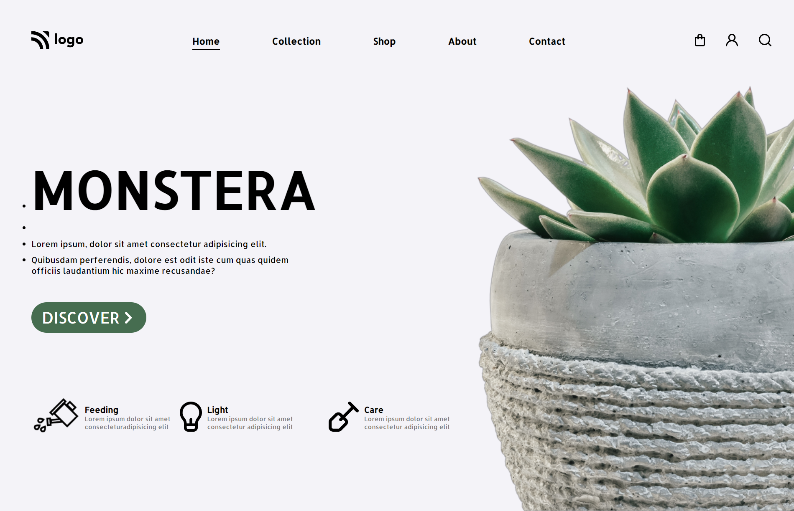

# Plant Home Page | 

Hello,

I'm `Ammar Azam Khan`. This is the 6th assignment in my `Full Stack Javascript Bootcamp`, where I developed this website. This website is not responsive.

The Home page contains:

- Navbar
- Feature Section
- Service Section

## 🛠 Technologies Used

&emsp; &ensp;  

## 💻Check out the link below for a preview.

&emsp; &ensp; `note` This site is not responsive.

&emsp; &ensp; &ensp;[Live Preview](https://plantex-landing-page.netlify.app)

## 📸 Screenshot

## 📝 My learning from this project

- I learned about CSS Position.
- I learned how to align items with CSS flexbox.

## ⌛ Time taken to finish the project

- Approximately `3 hours`.
